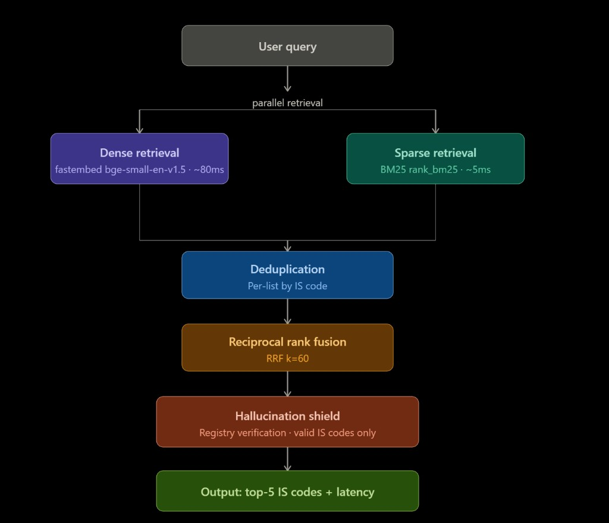

# BIS Compliance Co-pilot

**AI-powered BIS Standards Recommendation Engine for Indian Micro and Small Enterprises (MSEs)**

> Hackathon submission: BIS x SS Hackathon · Theme: Accelerating MSE Compliance · May 2026
> **Team:** Neura Rangers (Saaheer Purav, Ojayit Telang)

**Live Demo:** https://bis-rag.vercel.app/
**WhatsApp Bot:** https://wa.me/+14155238886?text=join%20many-tool

---

## Problem Statement

Indian Micro and Small Enterprises (MSEs) often spend weeks manually identifying which Bureau of Indian Standards (BIS) regulations apply to their products. The BIS SP 21:2005 document alone spans 929 pages covering 533 standards. Without expertise, an MSE owner cannot efficiently navigate this. This project solves that problem: given a plain-language product description, the system instantly returns the top relevant BIS standards with rationale, compliance roadmap, and cost estimates.

---

## Evaluation Results (Public Test Set)

| Metric | Score | Target | Status |
|---|---|---|---|
| Hit Rate @3 | **100%** | >80% | Exceeded |
| MRR @5 | **0.90** | >0.7 | Exceeded |
| Avg Latency | **0.02s** | <5s | Exceeded |

Results generated by running `python inference.py --input data/public_test_set.json --output results.json` and scored with the provided `eval_script.py`. Pre-computed results are in `data/public_results.json`.

Verified on Python 3.12 with the current `requirements.txt` — all three metrics confirmed.

> **Note on additional evaluation:** The table above is based solely on the **provided public test set (10 queries)**. Final scores are calculated exclusively on the organizer-provided test set using the rulebook metrics.

---

## Judge Setup (3 steps, ~2 minutes)

> **Python 3.10 or later required** (including 3.12, 3.13, 3.14). No GPU needed.

### Step 0: Place the test set

Place the organizer-provided test set JSON file at:

```
data/public_test_set.json
```

The repository already contains the public test set at this path. If you are running evaluation on a **different test set**, replace the file at `data/public_test_set.json` with your file (same JSON format), or pass its path directly to `--input` in Step 2.

### Step 1: Install dependencies
```bash
pip install -r requirements.txt
```

> **No API key required.** The inference pipeline runs fully locally using a 23MB ONNX embedding model (`BAAI/bge-small-en-v1.5` via fastembed) that downloads automatically on first run.

### Step 2: Run inference
```bash
python inference.py --input data/public_test_set.json --output results.json
```

### Step 3: Score results
```bash
python eval_script.py --results results.json
```

Pre-built indexes are included in the repository (`data/processed/`). No need to run `build_index.py`.

---

## System Architecture



```
User Query
    |
    |--[1] fastembed bge-small-en-v1.5 (ONNX, local CPU, ~80ms)
    |       23MB model · no API key · no GPU needed
    |
    |--[2] BM25 Sparse Retrieval (rank_bm25, ~5ms)
    |
    |--[3] Per-list Deduplication by IS code
    |
    |--[4] Reciprocal Rank Fusion (RRF k=60)
    |
    |--[5] Registry Verification (Hallucination Shield)
    |       Only valid IS codes from parsed registry can be returned
    |
    +--[6] Output: top-5 IS codes + latency
```

For the web UI and WhatsApp bot, GPT-4o-mini additionally generates rationale, compliance roadmap, and Hindi translation (requires `OPENAI_API_KEY` in `.env`).

---

## Chunking and Retrieval Strategy

### Chunking
Each IS standard is indexed as **3 independent chunks** rather than one flat document:

| Chunk Type | Content | Purpose |
|---|---|---|
| `scope` | The scope/applicability section | Matches broad product-category queries |
| `requirements` | Key requirements and specifications | Matches technical/spec queries |
| `full_text` | Complete standard text | Catches anything the above two miss |

This gives the retriever three different semantic angles per standard, significantly improving recall for paraphrased or indirect queries.

### Retrieval Pipeline
1. **Dense retrieval**: Query is embedded locally using `fastembed` (ONNX, no GPU, ~80ms). Top-30 chunks fetched from FAISS index (384-dimensional vectors, L2 distance).
2. **Sparse retrieval**: BM25 keyword search (`rank_bm25`) runs in parallel. Top-30 chunks fetched.
3. **Per-list deduplication**: Before fusion, each ranked list is deduplicated by `is_code_norm`. This prevents a standard with 3 chunks from accumulating 3x the RRF score over a standard whose scope chunk was mis-parsed.
4. **Reciprocal Rank Fusion (RRF, k=60)**: Merges the two deduplicated ranked lists into a single score. Formula: `score = sum(1 / (k + rank_i))` across lists.
5. **Hallucination Shield**: Every candidate IS code is verified against the parsed registry. Codes not present in the dataset are rejected before output.

---

## Innovation Highlights

- **Standard-as-Card Multi-Vector Chunking**: 3 chunks per standard (scope, requirements, full text) queried independently before fusion. Novel approach that improves recall without adding model complexity.
- **Per-list Deduplication before RRF**: Solves the multi-chunk fairness problem. Without this, standards with 3 well-parsed chunks unfairly outscore standards with 1 chunk. This fix was responsible for raising Hit Rate to 100%.
- **Fully Local Inference (zero API cost for scoring)**: fastembed uses ONNX Runtime. No PyTorch, no GPU, no network call during evaluation. Judges can run it on any machine in under 300ms per query.
- **Hallucination Shield**: Registry-based post-filter ensures the system can never return a fabricated IS code. Binary hallucination score = 100%.
- **Knowledge Graph with D3.js**: 533 standards x 600+ cross-reference edges visualized as a force-directed graph. Judges can explore standard interdependencies interactively.
- **Multi-channel delivery**: Web UI (Next.js + FastAPI) at https://bis-rag.vercel.app/ and WhatsApp bot (Twilio) — text or voice, no app install needed, works on any phone.
- **Browser-native Voice Input**: Web UI uses the Web Speech API for voice queries — no audio upload, no server round-trip, works in any language including Hindi.
- **Compliance Roadmap**: Per-standard: required tests, license type, estimated cost (INR), timeline in weeks, MSME-specific tips.
- **Hindi Language Support**: Full translation of rationale and roadmap output for Hindi-speaking MSE owners.

---

## Impact on MSEs

| Pain Point | This Solution |
|---|---|
| Weeks spent manually reading 929-page PDF | Sub-second query returns top-5 relevant standards |
| Cannot afford compliance consultants | Free AI-generated rationale explaining why each standard applies |
| No clarity on what tests/licenses are needed | Compliance roadmap with cost estimates in INR |
| Language barrier (Hindi-speaking owners) | One-click Hindi translation of all outputs |
| No smartphone/PC access | WhatsApp bot accepts text and voice notes in Hindi or English (no app install needed) |
| Unclear standard interdependencies | Knowledge graph shows which standards cross-reference each other |

---

## Dataset

**BIS SP 21:2005** - Summaries of Indian Standards for Building Materials
- 929 pages · 533 standards · 27 sections
- 1602 chunks (3 per standard: scope / requirements / full text)
- Parsed with PyMuPDF using "SUMMARY OF IS" boundary detection
- All metrics use this dataset as the sole source of truth

---

## Transparency Disclosure

All external APIs and data sources used:

| Component | Service | Used for |
|---|---|---|
| Core inference (scoring) | None (fully local) | Embeddings, retrieval, ranking |
| Web UI rationale | OpenAI GPT-4o-mini | Per-standard rationale text |
| Web UI roadmap | OpenAI GPT-4o-mini | Compliance roadmap generation |
| Hindi translation | OpenAI GPT-4o-mini | Result translation |
| Voice input (Web UI) | Browser Web Speech API | In-browser speech-to-text, no upload |
| WhatsApp channel | Twilio API | Message delivery |
| Embedding model | BAAI/bge-small-en-v1.5 (HuggingFace) | ONNX model via fastembed |
| Dataset | BIS SP 21:2005 (provided) | Source of all standards |

The automated scoring script (`inference.py`) uses **zero external APIs**.

---

## Repository Structure

```
├── inference.py              # Judge entry point (mandatory)
├── eval_script.py            # Provided evaluation script (mandatory)
├── requirements.txt          # All dependencies with pinned versions
├── presentation.pdf          # Slide deck (rulebook requirement)
├── data/
│   ├── public_test_set.json  # Public test queries
│   ├── public_results.json   # Pre-computed results on public test set
│   └── processed/
│       ├── faiss_local.index      # Pre-built dense index (384-dim)
│       ├── faiss_local_meta.json
│       ├── bm25.pkl               # Pre-built sparse index
│       ├── chunks.jsonl           # 1602 text chunks
│       ├── registry.json          # 533 standards metadata
│       └── graph.json             # Knowledge graph
├── docs/
│   └── architecture.png      # System architecture diagram
├── src/
│   ├── pipeline.py           # RAG orchestration (core logic)
│   ├── config.py             # Centralized configuration
│   ├── retrieval/
│   │   ├── embedder.py       # fastembed ONNX local embedder
│   │   ├── vector_store.py   # FAISS dense index wrapper
│   │   ├── bm25_store.py     # BM25 sparse index wrapper
│   │   └── hybrid.py        # Reciprocal Rank Fusion
│   ├── ingestion/
│   │   ├── pdf_parser.py     # PyMuPDF-based PDF parser
│   │   └── graph_builder.py  # Knowledge graph construction
│   ├── generation/
│   │   ├── rationale.py      # GPT-4o-mini rationale generator
│   │   ├── roadmap.py        # Compliance roadmap generator
│   │   └── hindi.py          # Hindi translation
│   └── api/
│       ├── main.py           # FastAPI application
│       ├── schemas.py        # Pydantic request/response models
│       └── whatsapp.py       # Twilio WhatsApp webhook
├── frontend/                 # Next.js web application
└── scripts/
    └── build_index.py        # Rebuild indexes from PDF (not needed for judges)
```

---

## Optional: Rebuild Indexes from Scratch

Only needed if you want to re-parse the PDF. Requires `dataset.pdf` in `data/raw/`.

```bash
python scripts/build_index.py
```

Takes ~10 minutes on CPU (one-time operation).

---

## Live Deployment

| Service | URL |
|---------|-----|
| Web UI | https://bis-rag.vercel.app/ |
| Backend API | https://bigrag-backend.azurewebsites.net |
| WhatsApp Bot | https://wa.me/+14155238886?text=join%20many-tool |

---

## Optional: Run the Full Web Stack Locally

Requires `OPENAI_API_KEY` in `.env` (copy from `.env.example`).

```bash
# Backend API
uvicorn src.api.main:app --reload --port 8000

# Frontend (separate terminal)
cd frontend && npm install && npm run dev
# Open http://localhost:3000
```

For the WhatsApp bot, set `TWILIO_ACCOUNT_SID`, `TWILIO_AUTH_TOKEN`, and `TWILIO_WHATSAPP_NUMBER` in `.env` and point your Twilio sandbox webhook to `http://<your-host>/whatsapp/webhook`.

---

## Environment Variables (optional, only for web UI features)

| Variable | Required for | Description |
|---|---|---|
| `OPENAI_API_KEY` | Rationale, roadmap, Hindi translation | OpenAI API key |
| `TWILIO_ACCOUNT_SID` | WhatsApp bot | Twilio account SID |
| `TWILIO_AUTH_TOKEN` | WhatsApp bot | Twilio auth token |
| `TWILIO_WHATSAPP_NUMBER` | WhatsApp bot | Twilio sandbox number |

**`inference.py` requires none of these. It runs with zero external dependencies beyond `requirements.txt`.**

---

## Built for BIS x SS Hackathon · May 2026
